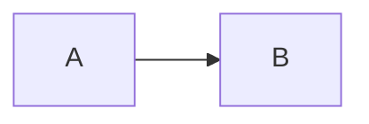
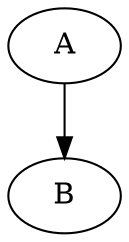

# Compiler & CLI notes

Offline-first build pipeline for Markdown / HTML → self-contained `.rdoc` / `.rdoc.html`.

## Feature matrix (MVP)

| Feature | Status | Notes |
| --- | --- | --- |
| Chunked image encode + streamed write | **Done** | Base64 in ~48KB chunks; output written in 64KB stream slices |
| `--assets-dir` | **Done** | Resolve relative `` against an explicit root |
| `--fail-on-external` (default true) | **Done** | Rejects `http(s)` / `//` images; `data:` + local OK |
| `--allow-data-images-only` | **Done** | Alias forcing the same policy as default fail-on-external |
| YAML front-matter | **Done** | Minimal parser (no gray-matter); title/author/tags/description/… |
| GFM task lists | **Done** | Via `marked` GFM + checkbox normalize |
| Footnotes polish | **Done** | Numbered refs + end list + popover defs |
| Definition lists | **Done** | Pandoc-style `Term` / `: def` preprocess |
| Syntax highlight (Prism) | **Done** | Compile-time; CSS inlined only when code fences present (~+few KB) |
| Mermaid → SVG | **Partial** | Needs `mmdc` or `npx @mermaid-js/mermaid-cli`; else warning + code fence |
| Graphviz → SVG | **Partial** | Needs `dot` on PATH; else warning + code fence |
| Math (KaTeX) | **Done** | `$…$` / `$$…$$` / `\(` `/` `\[` → HTML+MathML; compact CSS (no webfont CDN) |
| BibTeX citations | **Partial** | Subset `.bib` parse + `[@key]`; not full CSL styles |
| HTML input | **Done** | `rdoc build page.html`; optional `--readability` chrome strip |
| `rdoc diff` | **Done** | Manifest fields + `contentHash` + plain-text line diff |

## CLI examples

```bash
# Markdown with assets root + bibliography
rdoc build note.md -o note.rdoc.html \
  --assets-dir ./static \
  --bibliography refs.bib \
  --allow-data-images-only

# HTML article extract
rdoc build page.html -o page.rdoc.html --readability

# Disable optional compile-time enhancers
rdoc build note.md -o note.rdoc.html --no-highlight --no-math --no-diagrams

# Compare two builds
rdoc diff a.rdoc.html b.rdoc.html
```

### Front-matter

```markdown
---
title: My note
author: Ada
tags: [offline, demo]
description: Short summary
---

# Body heading (ignored if title set above)
```

Priority for identity fields: **CLI flags > front-matter > `rdoc.config.json` > defaults**.

### Diagrams (optional tools)

```bash
# Mermaid
npm i -g @mermaid-js/mermaid-cli   # provides `mmdc`

# Graphviz
# Windows: winget install graphviz  (or choco / scoop)
# macOS:   brew install graphviz
# Linux:   apt install graphviz
```

Fenced blocks:

````markdown



````

### Size tradeoffs

| Enhancer | When inlined | Approximate add to output |
| --- | --- | --- |
| Prism CSS + tokens | Any highlighted fence | ~2–8 KB CSS + markup |
| KaTeX CSS + HTML | Any `$` / `$$` math | ~2–15 KB depending on expressions |
| Mermaid/Graphviz SVG | When CLI succeeds | Diagram-dependent |

No CDN links are emitted. Use `--no-highlight` / `--no-math` / `--no-diagrams` to keep files lean.
